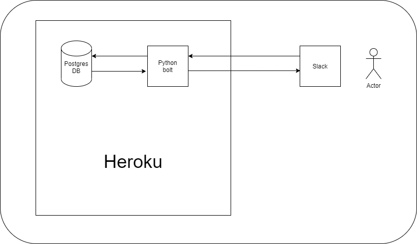
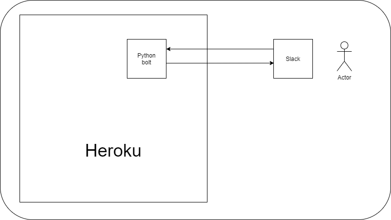

# slack-pin-scheduler

をつくりたい

## 一回読んだ

* [Djangoの環境をDocker化する（Docker + Django + Gunicorn + nginx）その１ - Qiita](https://qiita.com/amazipangu/items/bce228f506f894cd825d)
* [ローカルにあるdocker-composeプロジェクトをリモートのDockerで実行する - Qiita](https://qiita.com/legacyworld/items/0fb8507a8951e13f8061)
* [docker-composeでpostgresの設定を変更する方法 - Qiita](https://qiita.com/ihatov08/items/72bb5bd4feeef87e77a5)

一番最初のものを中心に進めてきたが、微妙にうまく行ってないので方針検討中

## gunicornについて

* [Running Gunicorn — Gunicorn 20.1.0 documentation](https://docs.gunicorn.org/en/stable/run.html#gunicorn)
    * この辺りを読んで必要なオプションを選ぶ
* [gunicorn の起動オプション - 清水川のScrapbox](https://scrapbox.io/shimizukawa/gunicorn_%E3%81%AE%E8%B5%B7%E5%8B%95%E3%82%AA%E3%83%97%E3%82%B7%E3%83%A7%E3%83%B3)
    * 読みやすくて参考になった

## boltについて

* herokuで動かすなら bolt-python/examples/heroku あたりを眺める
* 公式ドキュメントではトークンの取得方法が丁寧に書かれている（動かすのは難しい）
    * https://slack.dev/bolt-python/ja-jp/tutorial/getting-started
    * message を受け取るところあたりから難しく、challenge のレスポンスを正しく返す必要がある
        * これがこのドキュメントだけだと完結が難しい部分
        * 実際の GitHub リポジトリを見に行った方が早い
* 参考になりそうなのはこれ
    * [Slack Bolt for Pythonを使ってのbot構築。ローカル開発からHerokuデプロイまで - Qiita](https://qiita.com/geeorgey/items/c1e147eda40f6d652446)

## herokuへのデプロイ

* [Gunicorn を使用した Python アプリケーションのデプロイ | Heroku Dev Center](https://devcenter.heroku.com/ja/articles/python-gunicorn#adding-gunicorn-to-your-application)
    * これを見れば十分

## 今考えていること
### bata版

メモリに持たせて再起動ごとに壊れてしまうものの、一旦この形にしてみる

### alpha版

postgresを活用したい。
